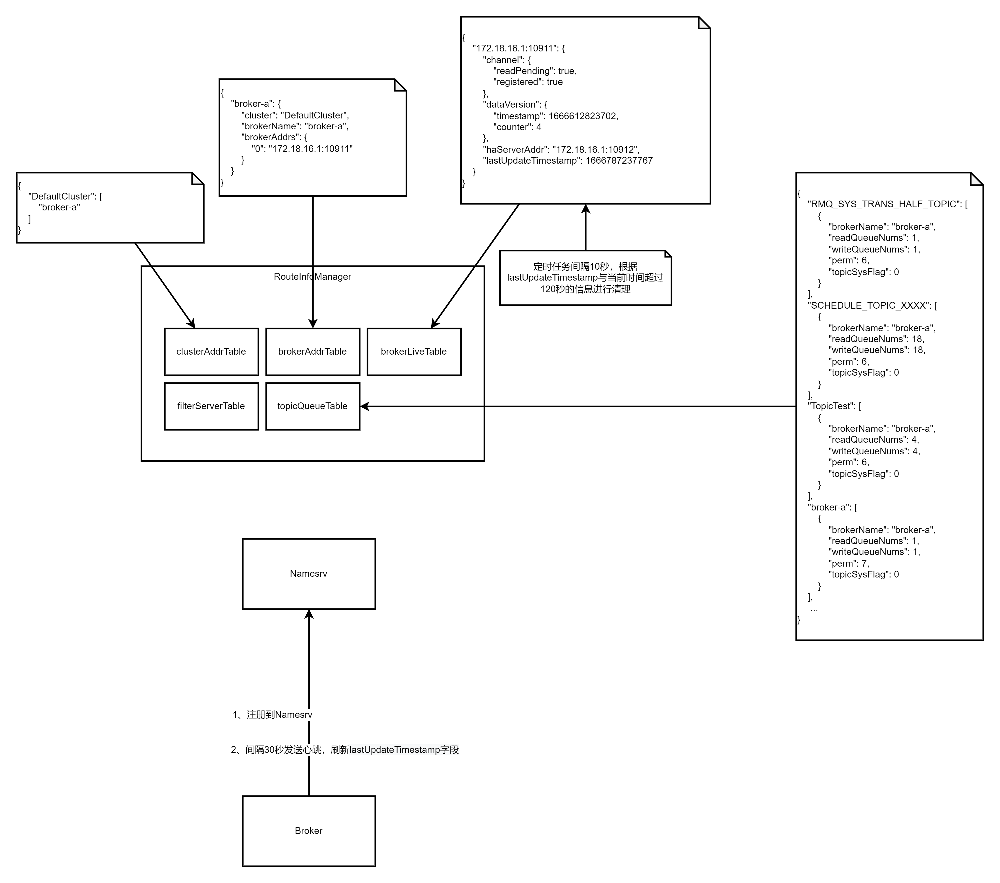

## 第一章

模块介绍

```
rocketmq
├── acl：权限控制模块
├── broker：broker模块（broker启动进程）
├── client：消息客户端，包含消息生产者和消费消费者相关类
├── common：公共包
├── dev：开发者信息（非源码）
├── distribution：打包分发目录（非源码）
├── exmpale：RocketMQ示例代码
├── filter：消息过滤相关基础类
├── logging：日志实现相关类
├── namesrv：NameServer实现相关类（NameServer启动进程）
├── openmessaging：消息开放标准，已发布
├── remoting：远程通行模块，基于Netty
├── srvutil：服务器工具类
├── store：消息存储实现类
├── style：checkstyle相关实现
├── test：测试相关类
└── tools：工具类，监控命令相关实现类
```

设计目标

1. 架构模式
2. 顺序消费
3. 消息过滤
4. 消息存储
5. 消息高可用性
6. 消息到达（消费）低延迟
7. 确保消息必须被消费一次
8. 回溯消息
9. 消息堆积
10. 定时消息
11. 消息重试机制

## 第二章-RocketMQ路由中心

#### NameServer架构设计




